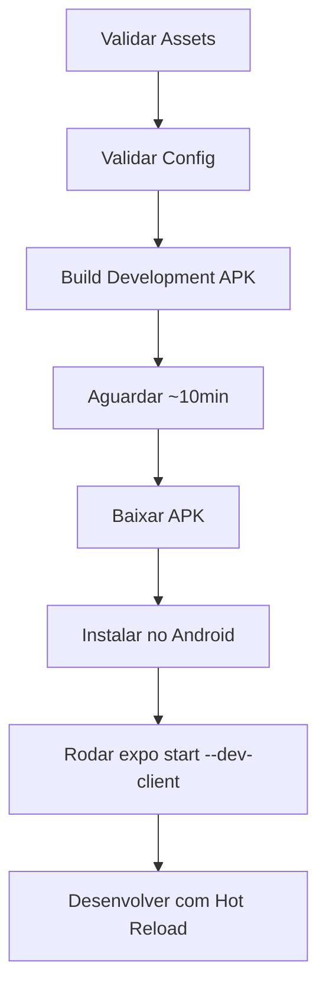
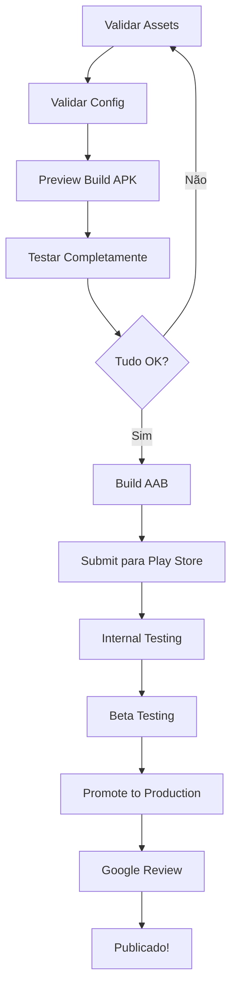

# 🤖 Guia Completo de Build para Android (WhiteLabel)

Este guia explica como fazer builds corretos para Android no sistema WhiteLabel multi-tenant.

---

## 🚨 Problemas Comuns e Soluções

### ❌ Problema: Package Name Errado

**Sintoma:**
```
Package Name: com.appplay.default  ❌ (errado)
```

**Deveria ser:**
```
Package Name: com.playmovel.app    ✅ (correto para tenant 46)
```

**Causa:** `TENANT_ID` não foi passado corretamente para o EAS Build

---

### ❌ Problema: APK vs AAB

**Pergunta comum:** Qual usar?

| Formato | Uso | Tamanho | Play Store |
|---------|-----|---------|------------|
| **APK** | Teste, Distribuição direta | Maior (~50-100MB) | ❌ Não recomendado |
| **AAB** | Publicação oficial | Menor (~30-60MB) | ✅ Obrigatório |

**Regra:**
- 🧪 **Teste/Preview:** Use APK (`--profile=preview`)
- 🚀 **Produção/Play Store:** Use AAB (`--profile=production-aab`)

---

## ✅ Como Fazer Build Corretamente

### **Opção 1: Usar o Script (RECOMENDADO)** 🌟

```bash
# Development Build (APK com Dev Client)
node scripts/build-partner.js 46 --platform=android --profile=development

# Preview Build (APK para testes)
node scripts/build-partner.js 46 --platform=android --profile=preview

# Production Build (APK)
node scripts/build-partner.js 46 --platform=android --profile=production

# Production Build (AAB para Play Store)
node scripts/build-partner.js 46 --platform=android --profile=production-aab

# Build para todas as plataformas
node scripts/build-partner.js 46 --platform=all --profile=development
```

**Vantagens:**
- ✅ Configura `TENANT_ID` automaticamente
- ✅ Valida se o tenant existe
- ✅ Verifica configurações antes do build
- ✅ Funciona em Windows, Mac e Linux

---

### **Opção 2: EAS Build Direto (Requer cuidado)**

**No Windows PowerShell:**
```powershell
$env:TENANT_ID="46"
$env:EXPO_PUBLIC_TENANT_ID="46"
npx eas build --platform android --profile development
```

**No Windows CMD:**
```cmd
set TENANT_ID=46
set EXPO_PUBLIC_TENANT_ID=46
npx eas build --platform android --profile development
```

**No Linux/Mac:**
```bash
TENANT_ID=46 EXPO_PUBLIC_TENANT_ID=46 npx eas build --platform android --profile development
```

---

## 📋 Checklist Antes de Fazer Build

### 1️⃣ **Validar Assets**

```bash
node scripts/validate-assets.js 46
```

**Deve retornar:**
- ✅ `icon.png` encontrado (1024x1024px)
- ✅ `adaptive-icon.png` encontrado (1024x1024px)
- ✅ `splash-icon.png` encontrado
- ✅ `backgroundColor` configurado no `app.config.json`

---

### 2️⃣ **Validar Configuração WhiteLabel**

```bash
node scripts/test-whitelabel-config.js --tenant=46
```

**Deve retornar:**
- ✅ Package: `com.playmovel.app`
- ✅ Nome: "Play Móvel"
- ✅ Adaptive Icon backgroundColor: `#000624`
- ✅ Assets carregados corretamente

---

### 3️⃣ **Verificar Keystores (Para Produção)**

```bash
# Listar credenciais configuradas
npx eas credentials

# Se necessário, configurar keystore
npx eas credentials:configure-build --platform=android
```

**⚠️ IMPORTANTE:** Para produção, você precisa de:
- 🔑 **Keystore** (arquivo .jks ou .keystore)
- 🔑 **Keystore password**
- 🔑 **Key alias**
- 🔑 **Key password**

O EAS pode gerar automaticamente ou você pode usar um existente.

---

## 🔧 Profiles de Build Disponíveis

### **development**
```json
{
  "developmentClient": true,
  "distribution": "internal"
}
```

**Características:**
- ✅ Dev Client embutido (hot reload)
- ✅ Ícone e splash customizados
- ✅ Gera APK (fácil instalação)
- ✅ Sem necessidade de keystore
- 🎯 **Use para:** Desenvolvimento ativo

**Como usar:**
```bash
# 1. Fazer build
node scripts/build-partner.js 46 --platform=android --profile=development

# 2. Baixar APK e instalar no celular

# 3. Rodar dev server
TENANT_ID=46 npx expo start --dev-client
```

**Tamanho estimado:** ~80-120MB (APK)

---

### **preview**
```json
{
  "distribution": "internal",
  "android": {
    "buildType": "apk",
    "gradleCommand": ":app:assembleRelease"
  }
}
```

**Características:**
- ✅ Build Release (otimizado)
- ✅ Gera APK para distribuição direta
- ✅ Sem dev tools
- ✅ Comportamento idêntico à produção
- ✅ Requer keystore
- 🎯 **Use para:** Testar antes de publicar

**Como usar:**
```bash
# Build para testes internos
node scripts/build-partner.js 46 --platform=android --profile=preview

# Baixar APK e distribuir para testers
# (via link direto, sem Play Store)
```

**Tamanho estimado:** ~60-90MB (APK)

---

### **production**
```json
{
  "autoIncrement": true,
  "android": {
    "buildType": "apk",
    "gradleCommand": ":app:assembleRelease"
  }
}
```

**Características:**
- ✅ Incrementa `versionCode` automaticamente
- ✅ Gera APK otimizado
- ✅ Para distribuição direta (fora da Play Store)
- ✅ Requer keystore
- 🎯 **Use para:** Distribuição APK direta (sideload)

**Como usar:**
```bash
# Build production APK
node scripts/build-partner.js 46 --platform=android --profile=production
```

**Tamanho estimado:** ~60-90MB (APK)

---

### **production-aab** (Play Store) 🌟
```json
{
  "extends": "production",
  "android": {
    "buildType": "app-bundle",
    "gradleCommand": ":app:bundleRelease"
  }
}
```

**Características:**
- ✅ Incrementa `versionCode` automaticamente
- ✅ Gera AAB (Android App Bundle)
- ✅ **OBRIGATÓRIO** para publicação na Play Store
- ✅ Google otimiza APKs por dispositivo
- ✅ Menor tamanho de download
- ✅ Requer keystore e Service Account JSON
- 🎯 **Use para:** Publicação oficial na Play Store

**Como usar:**
```bash
# Build AAB e submit para Play Store
node scripts/build-partner.js 46 --platform=android --profile=production-aab --auto-submit

# Apenas build (sem submit)
node scripts/build-partner.js 46 --platform=android --profile=production-aab
```

**Tamanho estimado:** ~40-70MB (AAB)

---

## 🎯 O que Aparece no Build

### **Development Build**

**Na Tela Inicial:**
```
┌─────────────┐
│   [ÍCONE]   │  ← Ícone da Play Móvel
│  Play Móvel │  ← Nome customizado
└─────────────┘
```

**Adaptive Icon (diferentes launchers):**
- ✅ Samsung: Círculo com fundo azul (#000624)
- ✅ Xiaomi: Squircle com fundo azul
- ✅ OnePlus: Arredondado com fundo azul
- ✅ Stock Android: Teardrop com fundo azul

**Ao Abrir:**
```
┌─────────────────────┐
│   [SPLASH SCREEN]   │  ← Fundo #000624 (azul escuro)
│   [LOGO CENTERED]   │  ← Logo da Play Móvel
└─────────────────────┘
     ↓
┌─────────────────────┐
│   [DEV TOOLS]       │  ← Menu de desenvolvimento
│   • Reload          │
│   • Debug           │
│   • Element Insp.   │
└─────────────────────┘
```

**Info do App (Configurações > Apps):**
- ✅ Package: `com.playmovel.app`
- ✅ Nome: "Play Móvel"
- ✅ Versão: `1.0.0 (1)`
- ✅ Tamanho: ~80-120MB

---

## 🔐 Configuração de Keystores

### **Opção 1: EAS Gera Automaticamente (Recomendado)**

```bash
# Durante o primeiro build de produção
node scripts/build-partner.js 46 --platform=android --profile=production

# EAS perguntará:
# "Would you like us to handle the process of creating a keystore for you?"
# → Responda: YES

# EAS vai:
# 1. Gerar keystore
# 2. Armazenar com segurança nos servidores Expo
# 3. Usar automaticamente em builds futuros
```

**Vantagens:**
- ✅ Totalmente automático
- ✅ Backup seguro
- ✅ Sem risco de perder o keystore
- ✅ Funciona para todos os tenants

---

### **Opção 2: Usar Keystore Existente**

```bash
# 1. Configurar credenciais
npx eas credentials

# 2. Selecionar projeto e plataforma Android

# 3. Escolher "Set up a new Android Keystore"

# 4. Fornecer:
#    - Caminho do keystore (.jks ou .keystore)
#    - Keystore password
#    - Key alias
#    - Key password
```

**⚠️ IMPORTANTE:**
- 🔒 Nunca commite keystores no Git
- 🔒 Faça backup do keystore em local seguro
- 🔒 Se perder o keystore, não poderá atualizar o app na Play Store

---

## 📦 APK vs AAB: Diferenças Detalhadas

### APK (Android Package)

**O que é:**
- Arquivo único `.apk`
- Contém todos os recursos (todas as densidades, arquiteturas)

**Vantagens:**
- ✅ Distribuição direta (via link, email, WhatsApp)
- ✅ Instalação simples (clicar e instalar)
- ✅ Não precisa de Play Store
- ✅ Funciona em qualquer dispositivo

**Desvantagens:**
- ❌ Tamanho maior (60-90MB)
- ❌ Play Store não aceita mais (apenas AAB)
- ❌ Desperdício de recursos (baixa tudo, usa pouco)

**Quando usar:**
- 🧪 Testes internos
- 👥 Beta testers
- 📱 Distribuição enterprise (B2B)
- 🏢 Apps internos da empresa

---

### AAB (Android App Bundle)

**O que é:**
- Arquivo `.aab` com recursos modulares
- Play Store gera APKs otimizados por dispositivo

**Vantagens:**
- ✅ **Obrigatório** para Play Store (desde 2021)
- ✅ Tamanho menor de download (30-50% menor)
- ✅ Google otimiza automaticamente
- ✅ Suporta recursos sob demanda (dynamic delivery)

**Desvantagens:**
- ❌ Não instala diretamente (precisa da Play Store)
- ❌ Depende do Google Play

**Quando usar:**
- 🚀 Publicação oficial na Play Store
- 📈 Apps públicos
- 🌍 Distribuição em massa

---

## 🚀 Processo de Publicação na Play Store

### 1️⃣ **Preparação**

```bash
# 1. Validar tudo
node scripts/validate-assets.js 46
node scripts/test-whitelabel-config.js --tenant=46

# 2. Testar com APK primeiro
node scripts/build-partner.js 46 --platform=android --profile=preview

# 3. Instalar e testar completamente
```

---

### 2️⃣ **Configurar Service Account (Google Play)**

**Primeiro, criar Service Account no Google Cloud:**

1. Acesse [Google Cloud Console](https://console.cloud.google.com/)
2. Crie um projeto (se não tiver)
3. Vá em **IAM & Admin** > **Service Accounts**
4. Crie uma conta de serviço
5. Baixe o arquivo JSON da chave

**Depois, configurar no Play Console:**

1. Acesse [Google Play Console](https://play.google.com/console/)
2. Vá em **Configurações** > **API Access**
3. Vincule o projeto do Google Cloud
4. Conceda permissões à service account

**Salvar o arquivo JSON:**
```bash
# Criar diretório de secrets
mkdir -p secrets

# Salvar arquivo JSON (um por tenant)
# secrets/google-play-46.json
```

**⚠️ IMPORTANTE:**
- 🔒 Nunca commite o arquivo JSON no Git
- 🔒 Adicione `secrets/` no `.gitignore`
- 🔒 Para CI/CD, use secrets do GitHub/GitLab

---

### 3️⃣ **Build AAB**

```bash
# Build AAB para Play Store
node scripts/build-partner.js 46 --platform=android --profile=production-aab
```

---

### 4️⃣ **Submit Automático (Opcional)**

```bash
# Build + Submit em um comando
node scripts/build-partner.js 46 --platform=android --profile=production-aab --auto-submit
```

**Ou manualmente:**
```bash
# 1. Fazer build
node scripts/build-partner.js 46 --platform=android --profile=production-aab

# 2. Aguardar build completar

# 3. Submit manual
npx eas submit --platform android --profile production
```

---

### 5️⃣ **Configurar no Play Console**

Após o submit, você precisa configurar no Play Console:

**Informações necessárias:**
- 📝 **Título:** Play Móvel
- 📝 **Descrição curta:** (até 80 caracteres)
- 📝 **Descrição completa:** (até 4000 caracteres)
- 🖼️ **Screenshots:** Mínimo 2, máximo 8 (por dispositivo)
- 🖼️ **Ícone:** 512x512px (PNG)
- 🖼️ **Feature graphic:** 1024x500px
- 🎬 **Vídeo:** (opcional) Link do YouTube
- 🏷️ **Categoria:** (ex: Comunicação, Utilitários)
- 📧 **Email de contato**
- 🔞 **Classificação etária**
- 🌍 **Países disponíveis**

---

### 6️⃣ **Testar com Internal Testing**

```bash
# Submit para track "internal"
npx eas submit --platform android --profile preview
```

**Track de testes:**
1. **Internal Testing:** Até 100 testers, sem review
2. **Closed Testing (Alpha):** Testers específicos, com review
3. **Open Testing (Beta):** Qualquer um pode testar, com review
4. **Production:** Publicação final, com review completo

---

### 7️⃣ **Promoção para Produção**

Depois de testar:
1. Acesse Play Console
2. Vá em **Testing** > **Internal Testing**
3. Clique em **Promote release**
4. Escolha **Production**
5. Aguarde review da Google (~1-3 dias)
6. Publicado! 🎉

---

## 🐛 Troubleshooting

### ❌ Erro: "Package name already in use"

**Causa:** Outro app já usa o package `com.playmovel.app`

**Solução:**
```bash
# 1. Verificar packages únicos
node scripts/test-whitelabel-config.js

# 2. Editar app.config.json do parceiro
# partners/partner-46-playmovel/app.config.json
{
  "android": {
    "package": "com.playmovel.app.unique"  // ← Deve ser único
  }
}
```

---

### ❌ Erro: "Keystore not found"

**Causa:** Build de produção sem keystore configurado

**Solução:**
```bash
# Configurar keystore
npx eas credentials:configure-build --platform=android

# Ou deixar EAS gerar automaticamente no próximo build
```

---

### ❌ Erro: "Build failed: minSdkVersion too low"

**Causa:** minSdkVersion configurado abaixo do exigido

**Solução:**
Verificar `app.json`:
```json
{
  "expo": {
    "android": {
      "minSdkVersion": 21  // Mínimo recomendado: 21 (Android 5.0)
    }
  }
}
```

---

### ❌ Erro: "Adaptive icon background color not set"

**Causa:** Cor de fundo do adaptive icon não configurada

**Solução:**
```json
// partners/partner-46-playmovel/app.config.json
{
  "android": {
    "adaptiveIcon": {
      "backgroundColor": "#000624"  // ← Adicionar esta linha
    }
  }
}
```

---

### ❌ Erro: "Service account key file not found"

**Causa:** Arquivo `secrets/google-play-{TENANT_ID}.json` não existe

**Solução:**
```bash
# 1. Criar diretório
mkdir -p secrets

# 2. Baixar service account JSON do Google Cloud

# 3. Salvar como secrets/google-play-46.json

# 4. Validar
ls secrets/google-play-46.json
```

---

### ❌ App não instala: "App not installed"

**Causa:** Tentando instalar APK com assinatura diferente

**Solução:**
```bash
# 1. Desinstalar app antigo
adb uninstall com.playmovel.app

# 2. Instalar novo APK
adb install app-release.apk
```

---

### ❌ Adaptive icon aparece cortado

**Causa:** Elementos importantes fora da safe zone

**Solução:**
- ✅ Safe zone do adaptive icon é 66% do centro
- ✅ Deixe 33% de margem nas bordas
- ✅ Use `backgroundColor` que combine com o ícone

**Testar em diferentes launchers:**
- Samsung One UI
- Xiaomi MIUI
- OnePlus OxygenOS
- Google Pixel (Stock Android)

---

## 📊 Fluxo Completo de Build

### Para Development Build:



**Comandos:**
```bash
# 1. Validar
node scripts/validate-assets.js 46

# 2. Build
node scripts/build-partner.js 46 --platform=android --profile=development

# 3. Aguardar e baixar APK

# 4. Instalar no celular

# 5. Desenvolver
TENANT_ID=46 npx expo start --dev-client
```

---

### Para Production (Play Store):



**Comandos:**
```bash
# 1. Validar
node scripts/validate-assets.js 46
node scripts/test-whitelabel-config.js --tenant=46

# 2. Preview APK para testar
node scripts/build-partner.js 46 --platform=android --profile=preview

# 3. Testar completamente no dispositivo

# 4. Build AAB para Play Store
node scripts/build-partner.js 46 --platform=android --profile=production-aab

# 5. Submit (opcional)
node scripts/build-partner.js 46 --platform=android --profile=production-aab --auto-submit

# 6. Configurar no Play Console

# 7. Testar com Internal Testing

# 8. Promover para Production
```

---

## 🔐 Variáveis de Ambiente Necessárias

### Para Build Local:
```bash
TENANT_ID=46
EXPO_PUBLIC_TENANT_ID=46
```

### Para CI/CD (GitHub Actions):
```yaml
EXPO_TOKEN: ${{ secrets.EXPO_TOKEN }}
GOOGLE_SERVICES_JSON: ${{ secrets.GOOGLE_SERVICES_JSON }}
```

### Service Account JSON (para submit automático):
```bash
# Caminho do arquivo
secrets/google-play-46.json

# Configurado em eas.json
{
  "submit": {
    "production": {
      "android": {
        "serviceAccountKeyPath": "./secrets/google-play-${TENANT_ID}.json",
        "track": "production"
      }
    }
  }
}
```

---

## 🎓 Perguntas Frequentes (FAQ)

### **1. Preciso fazer rebuild toda vez que mudo o código?**
- ❌ **Development Build:** Não! Use hot reload
- ✅ **Production Build:** Sim, sempre que for lançar

### **2. O ícone aparece no Development Build?**
- ✅ **Sim!** Aparece o ícone customizado + adaptive icon

### **3. A splash screen aparece no Development Build?**
- ✅ **Sim!** Aparece a splash customizada do parceiro

### **4. Posso ter múltiplos Dev Clients instalados?**
- ✅ **Sim!** Cada parceiro tem Package diferente

### **5. Quanto tempo demora um build?**
- ⏱️ Development: ~8-12 minutos
- ⏱️ Preview (APK): ~8-12 minutos
- ⏱️ Production (AAB): ~10-15 minutos

### **6. APK ou AAB para testes internos?**
- 🧪 **APK** (profile: preview) - mais fácil de distribuir

### **7. APK ou AAB para Play Store?**
- 🚀 **AAB** (profile: production-aab) - obrigatório!

### **8. Como testar adaptive icon?**
- 📱 Instale o APK em diferentes dispositivos
- 📱 Teste em Samsung, Xiaomi, OnePlus, Pixel
- 📱 Veja como o launcher renderiza o ícone

### **9. Posso mudar o keystore depois de publicar?**
- ❌ **NÃO!** Se perder o keystore, não poderá atualizar o app
- 🔒 **Sempre faça backup** do keystore

### **10. Como atualizar app na Play Store?**
```bash
# 1. Incrementar versionCode no app.config.json
{
  "version": "1.0.1",  // ← versão do usuário
  "android": {
    "versionCode": 2   // ← incrementar
  }
}

# 2. Build nova versão
node scripts/build-partner.js 46 --platform=android --profile=production-aab

# 3. Submit
node scripts/build-partner.js 46 --platform=android --profile=production-aab --auto-submit
```

### **11. Como fazer rollback de uma versão?**
- ⚙️ No Play Console: **Release** > **Manage releases**
- ⚙️ Selecione uma versão anterior
- ⚙️ Clique em **Rollout** para promover

### **12. Como distribuir APK sem Play Store?**
```bash
# 1. Build APK
node scripts/build-partner.js 46 --platform=android --profile=preview

# 2. Baixar APK do EAS

# 3. Distribuir via:
#    - Link direto
#    - Firebase App Distribution
#    - Email/WhatsApp
#    - Servidor próprio
```

---

## 🔍 Testar Builds Localmente

### Instalar APK via ADB:

```bash
# 1. Conectar dispositivo via USB
adb devices

# 2. Instalar APK
adb install caminho/do/arquivo.apk

# 3. Ver logs
adb logcat | grep "ReactNative"
```

### Desinstalar app:

```bash
adb uninstall com.playmovel.app
```

### Capturar screenshot:

```bash
adb shell screencap -p /sdcard/screenshot.png
adb pull /sdcard/screenshot.png
```

---

## 🎨 Customização por Parceiro

Cada parceiro terá:

```
partners/partner-46-playmovel/
├── assets/
│   ├── icon.png               ✅ Ícone customizado
│   ├── adaptive-icon.png      ✅ Adaptive icon customizado
│   ├── splash-icon.png        ✅ Splash customizada
│   └── favicon.png
└── app.config.json
    {
      "android": {
        "package": "com.playmovel.app",           ✅ Package único
        "adaptiveIcon": {
          "backgroundColor": "#000624"            ✅ Cor única
        }
      },
      "splash": {
        "backgroundColor": "#000624"              ✅ Splash única
      }
    }
```

**Resultado:** Cada parceiro tem app completamente independente! 🎉

---

## 📞 Suporte

- **Documentação:** `CLAUDE.md`, `WHITELABEL.md`, `BUILD-IOS-GUIDE.md`
- **Scripts:**
  - `scripts/validate-assets.js`
  - `scripts/test-whitelabel-config.js`
  - `scripts/build-partner.js`
- **Logs:** Sempre verificar os logs do EAS Build para mais detalhes
- **EAS Build Dashboard:** https://expo.dev/accounts/[seu-username]/projects/[projeto]/builds

---

## 🚀 Próximos Passos

Após o build ser concluído com sucesso:

### **Para Development Build:**
1. ✅ Baixar APK do link fornecido
2. ✅ Instalar no Android (ativar "Instalar de fontes desconhecidas")
3. ✅ Rodar `TENANT_ID=46 npx expo start --dev-client`
4. ✅ Abrir o app no Android
5. ✅ Desenvolver normalmente com hot reload

### **Para Preview Build:**
1. ✅ Baixar APK do link fornecido
2. ✅ Instalar em múltiplos dispositivos
3. ✅ Testar todas as funcionalidades
4. ✅ Validar ícone, adaptive icon, splash, nome
5. ✅ Se OK → fazer Production Build

### **Para Production AAB:**
1. ✅ Build AAB completo
2. ✅ Submit para Play Store (manual ou --auto-submit)
3. ✅ Configurar listing no Play Console
4. ✅ Internal Testing
5. ✅ Beta Testing (opcional)
6. ✅ Promote to Production
7. ✅ Aguardar review da Google (~1-3 dias)
8. ✅ Publicado! 🎉

---

## 📚 Links Úteis

- [Android App Bundle](https://developer.android.com/guide/app-bundle)
- [Adaptive Icons](https://developer.android.com/guide/practices/ui_guidelines/icon_design_adaptive)
- [Play Console](https://play.google.com/console/)
- [EAS Build Documentation](https://docs.expo.dev/build/introduction/)
- [EAS Submit Documentation](https://docs.expo.dev/submit/introduction/)

---

**Lembre-se:**
- 🧪 **Testes:** Use APK (profile: preview)
- 🚀 **Play Store:** Use AAB (profile: production-aab)
- 📱 **Sempre valide** assets antes de fazer build!

**Sempre use o script `build-partner.js` para garantir que o `TENANT_ID` seja passado corretamente!** 🎯
