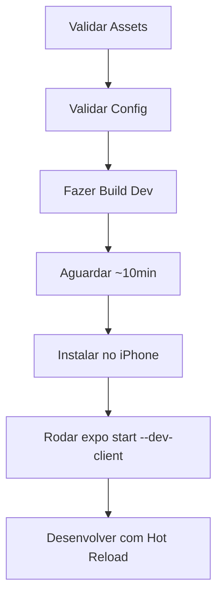
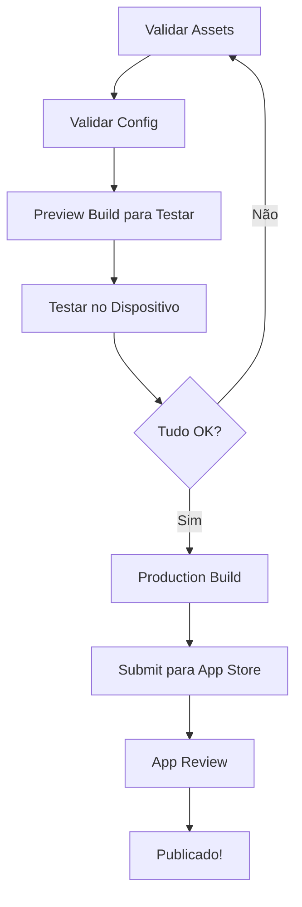

# 🍎 Guia Completo de Build para iOS (WhiteLabel)

Este guia explica como fazer builds corretos para iOS no sistema WhiteLabel multi-tenant.

---

## 🚨 Problemas Comuns e Soluções

### ❌ Problema: Bundle Identifier Errado

**Sintoma:**
```
Bundle Identifier         com.appplay.default  ❌ (errado)
```

**Deveria ser:**
```
Bundle Identifier         com.playmovel.app    ✅ (correto para tenant 46)
```

**Causa:** `TENANT_ID` não foi passado corretamente para o EAS Build

---

## ✅ Como Fazer Build Corretamente

### **Opção 1: Usar o Script (RECOMENDADO)** 🌟

```bash
# Development Build
node scripts/build-partner.js 46 --platform=ios --profile=development

# Preview Build
node scripts/build-partner.js 46 --platform=ios --profile=preview

# Production Build
node scripts/build-partner.js 46 --platform=ios --profile=production

# Build para todas as plataformas
node scripts/build-partner.js 46 --platform=all --profile=development
```

**Vantagens:**
- ✅ Configura `TENANT_ID` automaticamente
- ✅ Valida se o tenant existe
- ✅ Verifica configurações antes do build
- ✅ Funciona em Windows, Mac e Linux

---

### **Opção 2: EAS Build Direto (Requer cuidado)**

**No Windows PowerShell:**
```powershell
$env:TENANT_ID="46"
$env:EXPO_PUBLIC_TENANT_ID="46"
npx eas build --platform ios --profile development
```

**No Windows CMD:**
```cmd
set TENANT_ID=46
set EXPO_PUBLIC_TENANT_ID=46
npx eas build --platform ios --profile development
```

**No Linux/Mac:**
```bash
TENANT_ID=46 EXPO_PUBLIC_TENANT_ID=46 npx eas build --platform ios --profile development
```

---

## 📋 Checklist Antes de Fazer Build

### 1️⃣ **Validar Assets**

```bash
node scripts/validate-assets.js 46
```

**Deve retornar:**
- ✅ Todos os assets encontrados
- ✅ Dimensões corretas
- ✅ Configuração válida

---

### 2️⃣ **Validar Configuração WhiteLabel**

```bash
node scripts/test-whitelabel-config.js --tenant=46
```

**Deve retornar:**
- ✅ Bundle ID correto: `com.playmovel.app`
- ✅ Nome correto: "Play Móvel"
- ✅ Assets carregados corretamente

---

### 3️⃣ **Verificar Credenciais Apple**

```bash
# Listar credenciais configuradas
npx eas credentials

# Se necessário, reconfigurar
npx eas credentials:configure-build --platform=ios
```

---

## 🔧 Profiles de Build Disponíveis

### **development**
```json
{
  "developmentClient": true,
  "distribution": "internal"
}
```

**Características:**
- ✅ Dev Client embutido (hot reload)
- ✅ Ícone e splash customizados
- ✅ Instala via TestFlight ou link direto
- ✅ Conecta ao Metro bundler para desenvolvimento
- 🎯 **Use para:** Desenvolvimento ativo

**Como usar:**
```bash
# 1. Fazer build
node scripts/build-partner.js 46 --platform=ios --profile=development

# 2. Instalar no iPhone

# 3. Rodar dev server
TENANT_ID=46 npx expo start --dev-client
```

---

### **preview**
```json
{
  "distribution": "internal",
  "ios": {
    "simulator": true,
    "buildConfiguration": "Release"
  }
}
```

**Características:**
- ✅ Build Release (otimizado)
- ✅ Para Simulator ou dispositivo físico
- ✅ Sem dev tools
- ✅ Comportamento idêntico à produção
- 🎯 **Use para:** Testar antes de lançar

**Como usar:**
```bash
# Build para Simulator
node scripts/build-partner.js 46 --platform=ios --profile=preview

# Build para dispositivo físico
node scripts/build-partner.js 46 --platform=ios --profile=preview
```

---

### **production**
```json
{
  "autoIncrement": true,
  "ios": {
    "buildConfiguration": "Release",
    "resourceClass": "m-medium"
  }
}
```

**Características:**
- ✅ Incrementa versão automaticamente
- ✅ Otimizado para App Store
- ✅ Usa recursos mais poderosos (m-medium)
- 🎯 **Use para:** Release final na App Store

**Como usar:**
```bash
# Build e submit para App Store
node scripts/build-partner.js 46 --platform=ios --profile=production --auto-submit

# Apenas build (sem submit)
node scripts/build-partner.js 46 --platform=ios --profile=production
```

---

## 🎯 O que Aparece no Build

### **Development Build**

**Na Home Screen:**
```
┌─────────────┐
│   [ÍCONE]   │  ← Ícone da Play Móvel (customizado)
│  Play Móvel │  ← Nome customizado
└─────────────┘
```

**Ao Abrir:**
```
┌─────────────────────┐
│   [SPLASH SCREEN]   │  ← Fundo #000624 (azul escuro)
│   [LOGO CENTERED]   │  ← Logo da Play Móvel
└─────────────────────┘
     ↓
┌─────────────────────┐
│   [DEV TOOLS]       │  ← Menu de desenvolvimento
│   • Reload          │
│   • Debug           │
│   • Settings        │
└─────────────────────┘
```

**Info do App:**
- ✅ Bundle ID: `com.playmovel.app`
- ✅ Nome: "Play Móvel"
- ✅ Versão: `1.0.0`
- ✅ Build number: `1`

---

## 🐛 Troubleshooting

### ❌ Erro: "Unexpected token � in JSON"

**Causa:** Arquivo JSON com encoding inválido ou BOM (Byte Order Mark)

**Solução:**

```bash
# 1. Verificar encoding dos arquivos
node scripts/test-whitelabel-config.js --tenant=46

# 2. Se o erro persistir, recriar os arquivos JSON
# Abra o arquivo problemático e salve novamente com UTF-8 sem BOM
```

**Como salvar corretamente no VS Code:**
1. Abra o arquivo JSON problemático
2. Clique em "UTF-8" no canto inferior direito
3. Selecione "Save with Encoding"
4. Escolha "UTF-8" (sem BOM)

---

### ❌ Erro: "Bundle identifier already registered"

**Causa:** Outro tenant já usa o mesmo Bundle ID

**Solução:**

```bash
# 1. Verificar Bundle IDs únicos
node scripts/test-whitelabel-config.js

# 2. Editar app.config.json do parceiro
# partners/partner-46-playmovel/app.config.json
{
  "ios": {
    "bundleIdentifier": "com.playmovel.app"  // ← Deve ser único
  }
}
```

---

### ❌ Erro: "No valid code signing identities"

**Causa:** Certificados Apple não configurados

**Solução:**

```bash
# 1. Login com Apple ID
npx eas credentials

# 2. Selecionar tenant
# (escolha o tenant correto quando solicitado)

# 3. Configurar certificados
npx eas credentials:configure-build --platform=ios
```

---

### ❌ Erro: "ITSAppUsesNonExemptEncryption not found"

**Causa:** Campo obrigatório não configurado

**Solução:** ✅ **JÁ CORRIGIDO!** O `app.config.js` foi atualizado para incluir:

```javascript
infoPlist: {
  ITSAppUsesNonExemptEncryption: false,  // ← Adicionado
  // ... outros campos
}
```

---

### ❌ Erro: "Tenant not found"

**Causa:** Parceiro não existe no diretório `/partners`

**Solução:**

```bash
# 1. Listar parceiros disponíveis
ls partners/

# 2. Se o parceiro não existe, sincronizar do backend
node scripts/sync-configs.js 46

# 3. Ou criar manualmente
mkdir -p partners/partner-46-playmovel/assets
# (adicionar arquivos necessários)
```

---

## 📊 Fluxo Completo de Build

### Para Development Build:



**Comandos:**
```bash
# 1. Validar
node scripts/validate-assets.js 46
node scripts/test-whitelabel-config.js --tenant=46

# 2. Build
node scripts/build-partner.js 46 --platform=ios --profile=development

# 3. Aguardar e instalar

# 4. Desenvolver
TENANT_ID=46 npx expo start --dev-client
```

---

### Para Production Build:



**Comandos:**
```bash
# 1. Validar
node scripts/validate-assets.js 46
node scripts/test-whitelabel-config.js --tenant=46

# 2. Preview para testar
node scripts/build-partner.js 46 --platform=ios --profile=preview

# 3. Testar completamente

# 4. Production build
node scripts/build-partner.js 46 --platform=ios --profile=production

# 5. Submit (opcional, pode fazer pelo App Store Connect)
node scripts/build-partner.js 46 --platform=ios --profile=production --auto-submit
```

---

## 🔐 Variáveis de Ambiente Necessárias

### Para Build Local:
```bash
TENANT_ID=46
EXPO_PUBLIC_TENANT_ID=46
```

### Para CI/CD (GitHub Actions):
```yaml
EXPO_TOKEN: ${{ secrets.EXPO_TOKEN }}
APPLE_ID: ${{ secrets.APPLE_ID }}
ASC_APP_ID: ${{ secrets.ASC_APP_ID }}
APPLE_TEAM_ID: ${{ secrets.APPLE_TEAM_ID }}
```

---

## 🎓 Perguntas Frequentes (FAQ)

### **1. Preciso fazer rebuild toda vez que mudo o código?**
- ❌ **Development Build:** Não! Use hot reload
- ✅ **Production Build:** Sim, sempre que for lançar

### **2. O ícone aparece no Development Build?**
- ✅ **Sim!** Aparece o ícone customizado do parceiro

### **3. A splash screen aparece no Development Build?**
- ✅ **Sim!** Aparece a splash customizada do parceiro

### **4. Posso ter múltiplos Dev Clients instalados?**
- ✅ **Sim!** Cada parceiro tem Bundle ID diferente

### **5. Quanto tempo demora um build?**
- ⏱️ Development: ~10-15 minutos
- ⏱️ Preview: ~10-15 minutos
- ⏱️ Production: ~15-20 minutos

### **6. Como cancelar um build em andamento?**
```bash
# Listar builds
npx eas build:list

# Cancelar build específico
npx eas build:cancel <BUILD_ID>
```

### **7. Como ver logs de um build?**
```bash
# Listar builds recentes
npx eas build:list

# Ver detalhes de um build
npx eas build:view <BUILD_ID>
```

---

## 🚀 Próximos Passos

Após o build ser concluído com sucesso:

### **Para Development Build:**
1. ✅ Instalar no iPhone via link ou TestFlight
2. ✅ Rodar `TENANT_ID=46 npx expo start --dev-client`
3. ✅ Abrir o app no iPhone
4. ✅ Desenvolver normalmente com hot reload

### **Para Preview Build:**
1. ✅ Instalar no iPhone via link
2. ✅ Testar todas as funcionalidades
3. ✅ Validar ícone, splash, nome
4. ✅ Se OK → fazer Production Build

### **Para Production Build:**
1. ✅ Build completo
2. ✅ Submit para App Store (manual ou --auto-submit)
3. ✅ Aguardar review da Apple (~1-2 dias)
4. ✅ Publicar!

---

## 📞 Suporte

- **Documentação:** `CLAUDE.md`, `WHITELABEL.md`
- **Scripts:** `scripts/validate-assets.js`, `scripts/test-whitelabel-config.js`
- **Logs:** Sempre verificar os logs do EAS Build para mais detalhes

---

**Lembre-se:** Sempre use o script `build-partner.js` para garantir que o `TENANT_ID` seja passado corretamente! 🎯
